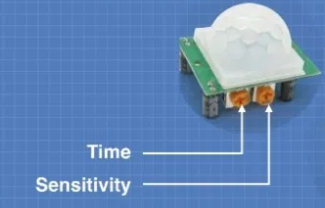
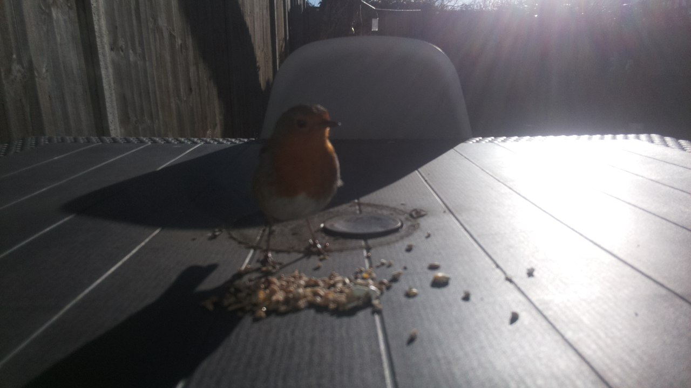

# Welcome to PiBird Watcher!

PiBird Watcher : Use a RaspberryPi associated with a PIR Sensor and a camera to watch bird in your garden. 

In my case, i get wifi in the garden so this project will detect when a bird is on the feeder, take a series of pictures and send them on Telegram, in my private group conversation so i get a direct notification.

# Hardware

 - Raspberry Pi 3 Model B+ ( https://www.raspberrypi.com/products/raspberry-pi-3-model-b-plus/ )
 - Naturebytes Wildlife Camera Case ( https://thepihut.com/products/naturebytes-wildlife-camera-case )
 - Raspberry Pi Camera Module V2.1  (https://thepihut.com/products/raspberry-pi-camera-module )
 - PIR Motion Sensor Module (https://thepihut.com/products/pir-motion-sensor-module)
 - 3-pin Sensor Cable (https://thepihut.com/products/3-pin-sensor-cable)
 - a SD Card
 - Battery ( https://www.amazon.co.uk/Anker-PowerCore-Ultra-Compact-Fast-Charging-Technology/dp/B019GJLER8 )

## PIR Sensor

In the project, the Power pin of the PIR sensor is connected to the PIN 2, Ground to pin 6 and input to pin 13


I changed the Time settings : Upon movement detection, it stays in an active state for around 25 seconds. During that time, it takes 5 pictures with few seconds interval



## Naturebytes Wildlife Camera Case

All information to mount the kit can be found here https://naturebytes.org/2020/09/03/wildlife-cam-kit-resources/
See Assembly Guides.

# Software

## Raspberry Pi

The RasperryPi has been configured with Raspberry Pi Os Lite ( no desktop environement ).
Ensure SSH / Camera / GPIO are activated.

Installed the required packages as root :

```
sudo apt-get update
sudo apt-get full-upgrade -y
sudo apt-get install "vim python3-pip python3-picamera pigpio" -y
sudo pip3 install python-telegram-bot python.dotenv --upgrade
```

Copy .env.sample in the same folder as the python script and rename it .env

## Telegram

I created a Bot on Telegram and added it in group with my account. There is various tutorial online.
You will need the BOT TOKEN as well as the Chat ID from your group.

Update the .env file

## Script

See pibirdwatcher.py.

## Service
```
cd /lib/systemd/system/
sudo nano pibirdwatcher.service
```

```
[Unit]
Description=PiBird Watcher
After=multi-user.target

[Service]
Type=simple
ExecStart=/home/pi/pibirdwatcher.py
Restart=on-abort
WorkingDirectory=/home/pi/

[Install]
WantedBy=multi-user.target
```

```
sudo chmod 644 /lib/systemd/system/pibirdwatcher.service
chmod +x /home/pi/pibirdwatcher.py
sudo systemctl daemon-reload
sudo systemctl enable pibirdwatcher.service
sudo systemctl start pibirdwatcher.service

sudo systemctl status pibirdwatcher.service

sudo journalctl -f -u pibirdwatcher.service
```

# Result


